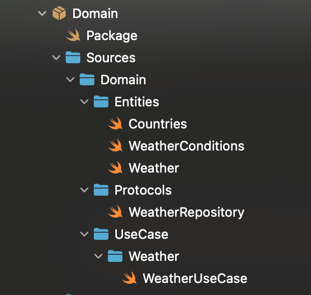
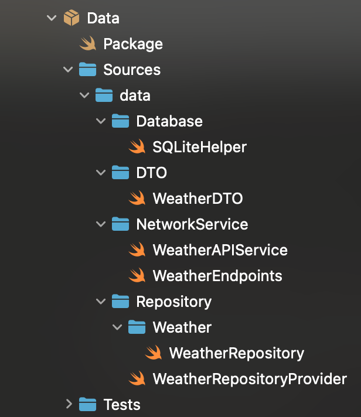
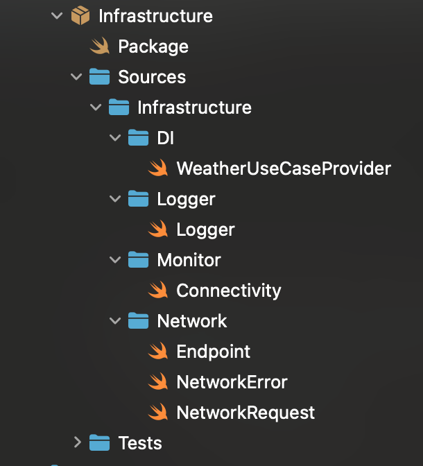
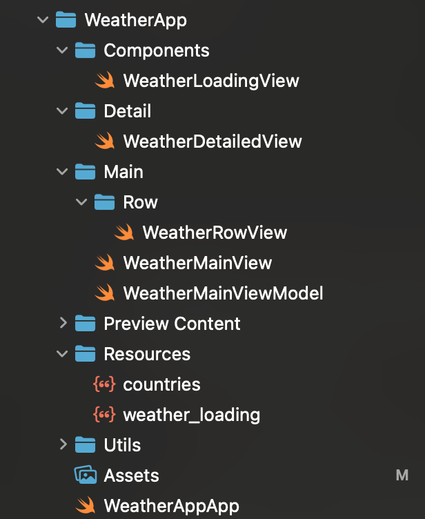

# Weather Demo App  


## Overview

This demo app is inspired by the Weather App on iOS, this project fetches data from API and caching data local. It is structured on a **Clean Architecture** pattern and follows the **SOLID principle**, making it scalable and maintainable.


## 📱 Features  
✔️ Fetches weather data from **OpenWeatherMap API**  

✔️ Supports **offline caching** using SQLite  

✔️ Displays detailed weather information with **dynamic backgrounds**  

✔️ Implements **Lottie animations** for custom loading indicator

✔️ Ability to change the temperature Units (Imperial/Metric)

✔️ Ability to delete cached weather data by sliding the list.

✔️ Search ability for countries, data coming from countries.json stored in bundle project


## 🏗️ Clean Architecture

This project structured into four layers, packing it seperately using **Swift Package Manager (SPM)** for modularity and scalability.

#### ❶ Domain Layer
Responsible for Business rules. It is considered independent of frameworks.

+ ****

+ **SOLID principles**

  ✔️ Single Responsibility

  ✔️ Interface Segregation

#### ❷Data Layer
Handles Data retrieval (API, local storing, conversion)
+ ****

+ **SOLID principles**

  ✔️ Liskov Substitution

  ✔️ Dependency Inversion

#### ❸Infrastructure Layer
It holds external dependencies such as, Network, Monitoring, Logger, Utilities.
+ ****

+ **SOLID principles**

✔️ Open-Closed Principle

✔️ Single Responsibility

#### ❹Presentation Layer
Basically handles UI, state management. Holds SwiftUI Views and View Models.
+ ****

+ **SOLID principles**

✔️ Open-Closed Principle

✔️ Dependency Inversion


## Installation
> 1. **Clone the Repository**:
>    ```bash
>    git clone https://github.com/deinerjohn/WeatherApp.git
>    cd weather-app
>    ```
> 2. **Install Dependencies**:
>    ```swift
>    swift package resolve  // Resolves SPM dependencies
>    ```
> 3. **Run the App in Xcode**

## 🧪 Unit Testing the Data Layer  

This project includes unit tests to ensure the reliability of the **`WeatherRepository`** and its interactions with the **API service** and **local database**.  

+ ****

### 🏗 Test Setup  
The unit tests are implemented using **XCTest**, mocking the dependencies to simulate scenarios

### 🛠 Mock Components  
To isolate the **`WeatherRepository`** from actual API calls and database interactions, we use **mock classes**:  
- **`MockWeatherAPIService`** simulates network responses (success & failure)  
- **`MockSQLiteHelper`** mimics local database operations

#### **1️⃣ Fetch Weather Successfully**  
```swift
func testFetchWeather_Success() async throws {
    // Given - Prepare mock API response
    let mockWeather = WeatherDTO(
        weather: [WeatherConditionDTO(main: "Clear", description: "Clear sky", icon: "01d")],
        main: MainWeatherDTO(temp: 20.5, pressure: 1012, humidity: 60, tempMin: 18.0, tempMax: 22.0),
        wind: WindDTO(speed: 3.5, deg: 120),
        clouds: CloudsDTO(all: 10),
        id: 1,
        cityName: "Tokyo",
        countryName: "Japan"
    )

    mockAPIService.mockResponse = mockWeather
    mockLocaldb.storedWeatherData = ["Tokyo": mockWeather]

    // When - Fetch weather data
    let result = try await repository.fetchWeather(country: "Japan", city: "Tokyo", units: "metric")

    // Then - Validate response
    XCTAssertEqual(result.cityName, "Tokyo")
    XCTAssertEqual(result.countryName, "Japan")
}
```

#### **2️⃣ Delete Weather Data**  
```swift
    func testDeleteWeatherData() async throws {
        
        let mockWeather = WeatherDTO(
            weather: [WeatherConditionDTO(main: "Sunny", description: "Clear sky", icon: "01d")],
            main: MainWeatherDTO(temp: 30.0, pressure: 1010, humidity: 40, tempMin: 28.0, tempMax: 32.0),
            wind: WindDTO(speed: 2.5, deg: 90),
            clouds: CloudsDTO(all: 5),
            id: 2,
            cityName: "Madrid",
            countryName: "Spain"
        )
        
        mockLocaldb.storedWeatherData = ["Madrid": mockWeather]
        
        do {
            try await mockLocaldb.deleteWeatherData(for: "Madrid")
            
            XCTAssertNil(mockLocaldb.storedWeatherData["Madrid"], "Madrid should be removed from the mock database")
        }
        
    }
```  
  
## Technology Used

+ SwiftUI – Modern UI Framework

+ Combine – Data binding & state management

+ OpenWeatherMap API – Weather data provider

+ Concurrency - Async/await task.

+ SQLite – Offline caching

+ Lottie – Custom loading indicator

+ Network Framework – Internet monitoring

+ Swift Package Manager (SPM) – Modular architecture (Used for external dependencies)

## Features in Action

+ Search for a country, and used the main city. (List of countries stored in 'countries.json')

+ Show detailed view for cached weather data.

+ Able to add and delete weather data. (Offline caching)

+ Network monitor. (Checking if network is reachable)

+ Toggle temperature units (Celcius/Fahrenheit)

## License
Feel free to use

## Author

Deiner John P. Calbang

