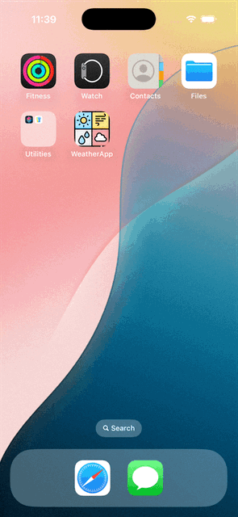
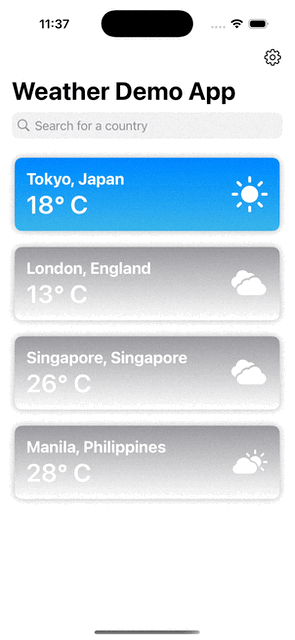
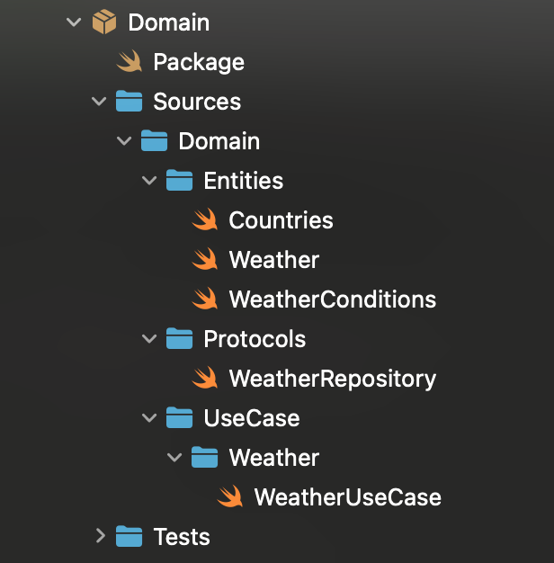
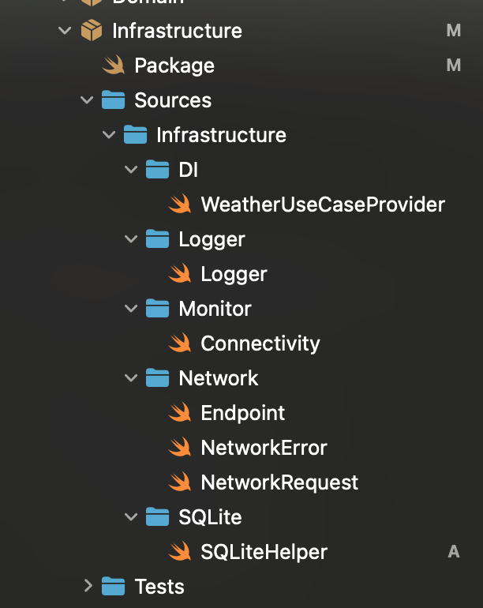
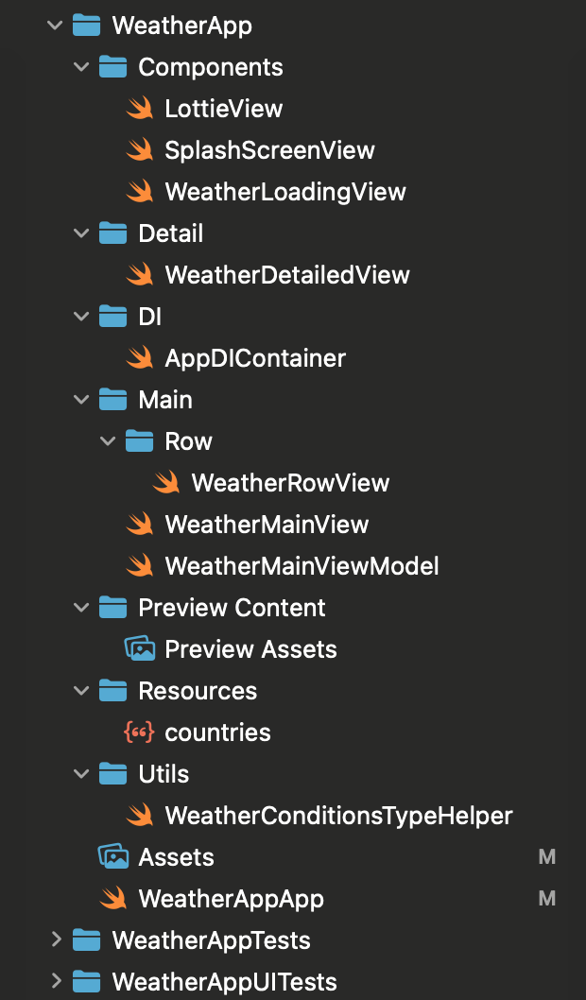

# Weather Demo App  




## Overview

This demo app is inspired by the Weather App on iOS, this project fetches data from API and caching data local. It is structured on a **Clean Architecture** pattern and follows the **SOLID principle**, making it scalable and maintainable.


## 📱 Features  
✔️ Fetches weather data from **OpenWeatherMap API**  

✔️ Supports **offline caching** using SQLite  

✔️ Displays detailed weather information with **dynamic backgrounds**  

✔️ Implements **Lottie animations** for custom loading indicator

✔️ Ability to change the temperature Units (Imperial/Metric)

✔️ Ability to delete cached weather data by sliding the list.

✔️ Search ability for countries, data coming from countries.json stored in bundle project

## User Interface & Animations

### 📌 Drag-to-Dismiss Weather Details
**drag-down** to dismiss the `WeatherDetailedView`

### Demo


### Code implementation

The drag gesture is implemented using ``DragGesture()`` in SwiftUI:

```swift
        .gesture(
            DragGesture()
                .updating($dragTranslation) { value, state, _ in
                    
                    if value.translation.height > 0 {
                        state = value.translation.height
                    }
                }
                .onChanged { value in
                    if value.translation.height > 0 {
                        dragOffset = value.translation.height
                    }
                }
                .onEnded { value in
                    //The '200' value is the treshold
                    if value.translation.height > 200 {
                        withAnimation(.spring(response: 0.5, dampingFraction: 0.8)) {
                            isPresented = false
                            dragOffset = 0
                        }
                    } else {
                        withAnimation(.spring(response: 0.5, dampingFraction: 0.8)) {
                            dragOffset = 0
                        }
                    }
                }
        )
```


## 🏗️ Clean Architecture

This project structured into four layers, packing it seperately using **Swift Package Manager (SPM)** for modularity and scalability.

#### ❶ Domain Layer
Responsible for Business rules. It is considered independent of frameworks.

****

+ **SOLID principles**

  ✔️ Single Responsibility

  ✔️ Interface Segregation

#### ❷Data Layer
Handles Data retrieval (API, local storing, conversion)

****

+ **SOLID principles**

  ✔️ Liskov Substitution

  ✔️ Dependency Inversion

#### ❸Infrastructure Layer
It holds external dependencies such as, Network, Monitoring, Logger, Utilities, SQLiteHelper.

****

+ **SOLID principles**

✔️ Open-Closed Principle

✔️ Single Responsibility

#### ❹Presentation Layer
Basically handles UI, state management. Holds SwiftUI Views and View Models.

****

+ **SOLID principles**

✔️ Open-Closed Principle

✔️ Dependency Inversion

### Dependency Injection (DI)
This sample app also shows the usage of Dependency Injection, keeping components loosely coupled.

### `AppDIContainer.swift`
It uses the Singleton pattern, accessible throughout the whole app.

```swift
final class AppDIContainer {
    
    static let shared = AppDIContainer()
    
    private let networkMonitor: NetworkConnectionMonitor
    private let sqliteHelper: SQLiteHelperProtocol
    
    private lazy var weatherRepositoryProvider: WeatherRepositoryProvider = {
        WeatherRepositoryProvider(sqliteHelper: sqliteHelper, networkMonitor: networkMonitor)
    }()
    
    private lazy var weatherRepository: WeatherRepository = {
        weatherRepositoryProvider.provideWeatherRepository()
    }()
    
    private lazy var weatherUseCase: WeatherUseCase = {
        WeatherUseCaseImpl(weatherRepository: weatherRepository)
    }()
    
    private init(
        networkMonitor: NetworkConnectionMonitor = NetworkConnectionMonitor(),
        sqliteHelper: SQLiteHelperProtocol = SQLiteHelper()
    ) {
        self.networkMonitor = networkMonitor
        self.sqliteHelper = sqliteHelper
    }
    
    func makeWeatherMainViewModel() -> WeatherMainViewModel {
        
        return WeatherMainViewModel(
            weatherUseCase: weatherUseCase,
            networkChecker: networkMonitor
        )
    }
    
}
```

Lazy loading dependencies such as `weatherRepository` and `weatherUseCase` are only being created when needed. Encapsulating the `makeWeatherViewModel` dependencies usage, it only interacts with UseCase.


## Installation
> 1. **Clone the Repository**:
>    ```bash
>    git clone https://github.com/deinerjohn/WeatherApp.git
>    cd weather-app
>    ```
> 2. **Install Dependencies**:
>    ```swift
>    swift package resolve  // Resolves SPM dependencies
>    ```
> 3. **Run the App in Xcode**

## 🧪 Unit Testing the Data Layer  

This project includes unit tests to ensure the reliability of the **`WeatherRepository`** and its interactions with the **API service** and **local database**.  

****

### 🏗 Test Setup  
The unit tests are implemented using **XCTest**, mocking the dependencies to simulate scenarios

### 🛠 Mock Components  
To isolate the **`WeatherRepository`** from actual API calls and database interactions, we use **mock classes**:  
- **`MockWeatherAPIService`** simulates network responses (success & failure)  
- **`MockSQLiteHelper`** mimics local database operations

#### **1️⃣ Fetch Weather Successfully**  
```swift
    func testFetchWeather_Success() async throws {
        // Given
        let mockWeather = WeatherDTO(
            weather: [WeatherConditionDTO(main: "Clear", description: "Clear sky", icon: "01d")],
            main: MainWeatherDTO(temp: 20.5, pressure: 1012, humidity: 60, tempMin: 18.0, tempMax: 22.0),
            wind: WindDTO(speed: 3.5, deg: 120),
            clouds: CloudsDTO(all: 10),
            id: 1,
            cityName: "Tokyo",
            countryName: "Japan"
        )
        
        //Inject sample response and inject weatherData
        mockAPIService.mockResponse = mockWeather
        mockLocaldb.storedWeatherData = ["Tokyo": mockWeather.toDomain()]
        
        do {
            
            let result = try await repository.fetchWeather(country: "Japan", city: "Tokyo", units: "metric")
            
            XCTAssertEqual(result.cityName, "Tokyo")
            XCTAssertEqual(result.countryName, "Japan")
            
        }
        

    }
```

#### **2️⃣ Delete Weather Data**  
```swift
    func testDeleteWeatherData() async throws {
        
        let mockWeather = Weather(
            weather: [WeatherCondition(main: "Clear", description: "Clear sky", icon: "01d")],
            main: MainWeather(
                temperature: Temperature(value: 20.5),
                pressure: Pressure(value: 1012),
                humidity: Humidity(value: 60),
                minTemperature: Temperature(value: 18.0),
                maxTemperature: Temperature(value: 22.0)
            ),
            wind: Wind(speed: Speed(value: 3.5), degree: 120),
            clouds: Clouds(coverage: 10),
            id: 1,
            countryName: "Spain",
            cityName: "Madrid"
        )
        
        mockLocaldb.storedWeatherData = ["Madrid": mockWeather]
        
        do {
            try await mockLocaldb.deleteWeatherData(for: "Madrid")
            
            XCTAssertNil(mockLocaldb.storedWeatherData["Madrid"], "Madrid should be removed from the mock database")
        }
        
    }
```  
  
## Technology Used

+ SwiftUI – Modern UI Framework

+ Combine – Data binding & state management

+ OpenWeatherMap API – Weather data provider

+ Concurrency - Async/await task.

+ SQLite – Offline caching

+ Lottie – Custom loading indicator

+ Network Framework – Internet monitoring

+ Swift Package Manager (SPM) – Modular architecture (Used for external dependencies)

## Features in Action

+ Search for a country, and used the main city. (List of countries stored in 'countries.json')

+ Show detailed view for cached weather data.

+ Able to add and delete weather data. (Offline caching)

+ Network monitor. (Checking if network is reachable)

+ Toggle temperature units (Celcius/Fahrenheit)

## Roadmap
+ 🔜 **Moving Backgrounds** - For dynamic weather-themed bg ex: (Snow, Rain)
  
+ 🔜 **Integrate Map** - Locate selected country with longitude and langitude and show it on map.

+ 🔜 **Splash Screen** - Add animated splash screen

+ 🔜 **5 to 10 days forecast** - Implement or add details that will show 5 to 10 days possible weather forecast.

## License
Feel free to use

## Author

Deiner John P. Calbang

